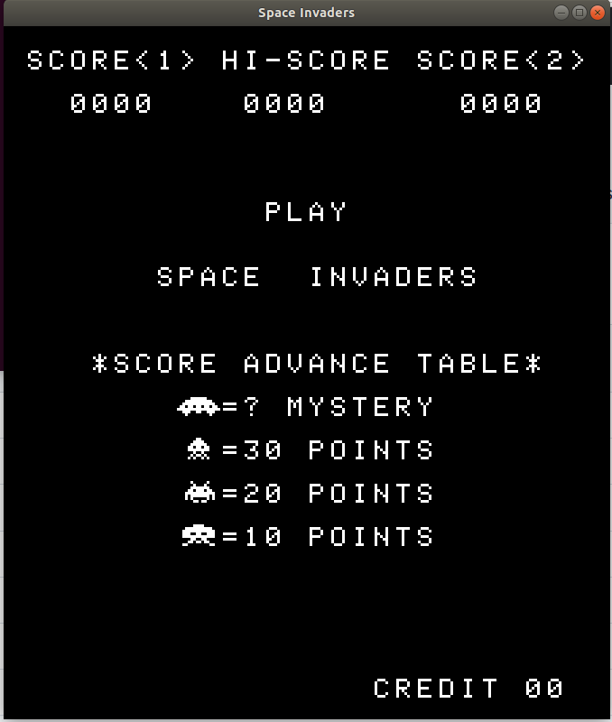

# i8080-Emulator
This is an emulator for the Intel 8080 CPU written entirely in C. The emulator is currently set to play the arcade game Space Invaders. The project consists of 2 parts: the CPU emulator as well as the hardware emulation needed to play Space Invaders.
The hardware emulation and graphics handling is based off another GitHub user (https://github.com/DanielH4/spaceinvaders-emulator), whom I've found to be of an extraordinary help.

The purpose of the CPU emulator part of the project is so that I can develop a deeper understanding of computer architecture and how the processor executes instructions. The Space Invaders emulation is for fun and entertainment as well as familiarizing myself with cross-platform development library (SDL) for introduction to graphics rendering and event handling

# Dependencies
- SDL2 & Ubuntu
- Space Invaders ROM Files

# To install SDL:
To install on Ubuntu, use command:
`sudo apt install libsdl2-dev`

# ROM Files:
- The required ROM files for Space Invaders are placed in `ROM` folder
- You can find these files online and download them and move them to whatever location you wish (but just be sure to use the correct file path when opening the files in your source code).

# Build:
- Need C compiler (GCC)
- Run `make` in the project directory. It will put all the object files into the `obj` folder and will put the final executable (`bin/game`) in `bin` folder
- Afterwards, simply type `bin/game`

# Game Controls:

| Key           | Action               |
| ------------- | -------------------- |
| C             | Insert Coin (Start)  |
| Enter         | Start Player1        |
| →             | Move Right           |
| ←             | Move Left            |
| Space bar     | Shoot                |
| Q             | Quit                 |

# Todos
- Yet to add sound to the game (whenever the user presses shoot, and also when collision between the shot and the alien(s) collide)
- Will look into SDL_mixer 2.0 library for audio rendering

# References
- https://altairclone.com/downloads/manuals/8080%20Programmers%20Manual.pdf (In-depth programming manual for i8080)
- http://www.emulator101.com/reference/8080-by-opcode.html (Gives description about each i8080 instruction opcode)
- https://pastraiser.com/cpu/i8080/i8080_opcodes.html (Table of i8080 opcodes for visualization)
- https://www.libsdl.org/release/SDL-1.2.15/docs/html/index.html (Manuals for SDL functions)
- http://www.emulator101.com/ (Tutorial on how to write an emulator)
- https://fms.komkon.org/EMUL8/HOWTO.html#LABH (Also a tutorial on how to write an emulator)

# Space Invader Code References
- https://github.com/DanielH4/spaceinvaders-emulator (Many thanks to this user)
- https://www.computerarcheology.com/Arcade/SpaceInvaders/ (Great info on Space Invader ROM/RAM layout, provides insight and expansion on assembly code instructions of the game, also have bunch of other arcade games to emulate)
